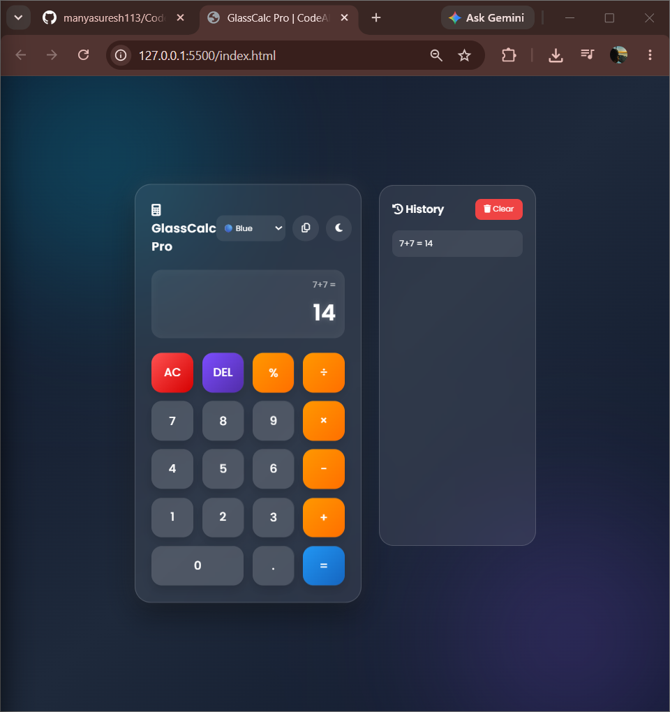
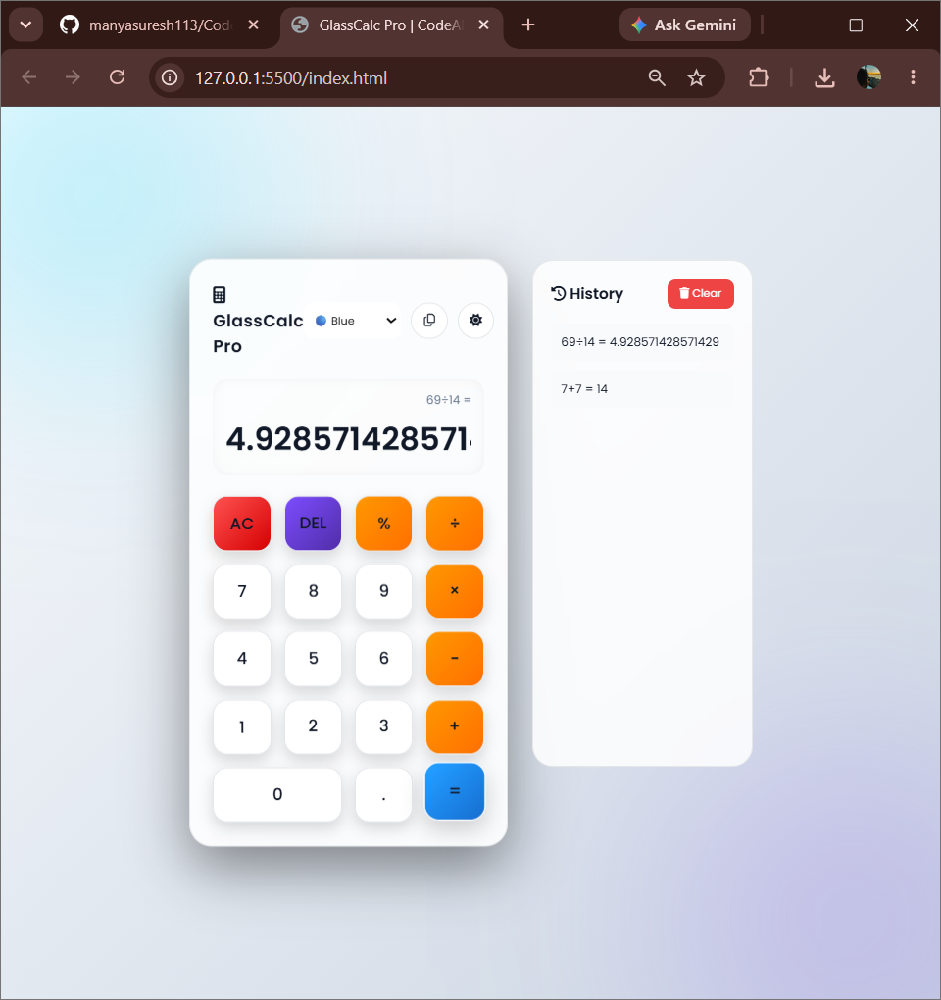
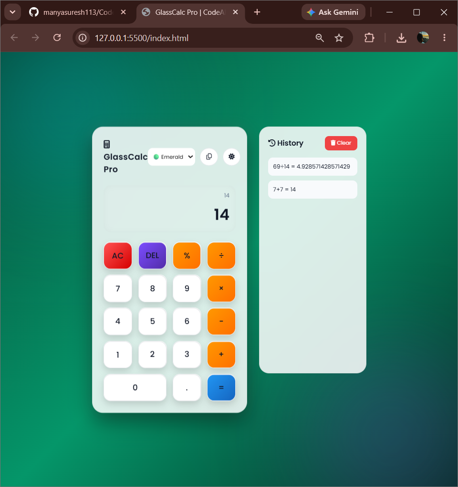

# 🧮 GlassCalc Pro

A modern glassmorphism calculator built as part of my **CodeAlpha Frontend Development Internship**.

## ✨ Features

- 🌙 Dark / Light mode
- 🎨 Multiple color themes
- ⌨️ Keyboard support
- 📋 Copy result
- 🧾 Calculation history
- 💾 Local Storage support
- 📱 Responsive design
- ✨ Smooth animations

## 🛠️ Tech Stack

- HTML5
- CSS3
- JavaScript (ES6)

## 🚀 Run Locally

```bash
git clone https://github.com/manyasuresh113/CodeAlpha_Calculator.git
```

Open `index.html` or use Live Server in VS Code.

## 🌐 Live Demo

After enabling GitHub Pages:

https://manyasuresh113.github.io/CodeAlpha_Calculator/

## 📂 Folder Structure

```
CodeAlpha_Calculator/
├── index.html
├── style.css
├── script.js
├── README.md
└── assets/
```
## Screenshots

### Dark Mode



### Light Mode



### History


## 👩‍💻 Author

**Manya Suresh**

Frontend Development Intern @ CodeAlpha

GitHub: https://github.com/manyasuresh113

⭐ If you like this project, consider starring the repository.
